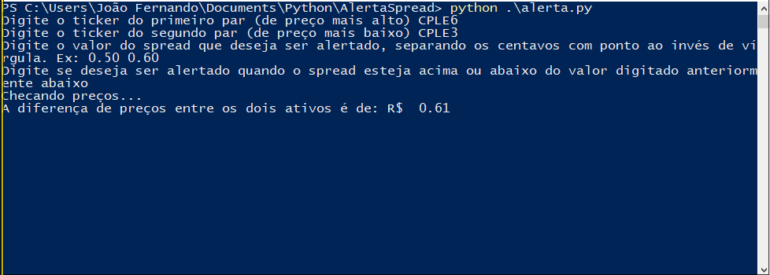
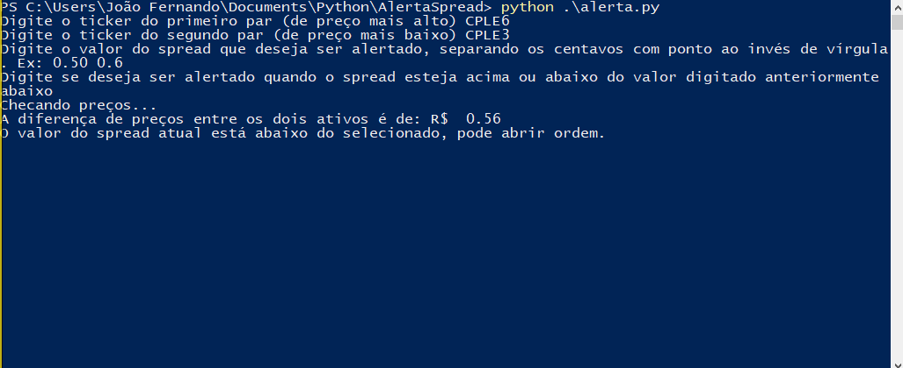

# AlertaSpread
Script em linha de comando para monitorar a diferença de preço entre duas ações.

## IMPORTANTE

- Como o script utiliza a biblioteca do Yahoo Finance, ela tem um delay de aproximadamente 15m, então a dica que deixo é rodar primeiro o comando:
```
python checa_precos.py
```
- Sabendo desse delay e da diferença de preços atual, quando rodar o script alerta.py conforme as instruções mais abaixo, ajustar o valor do spread com diferença de alguns centavos do seu alvo. Exemplo: se o alvo for abaixo de R$ 0,60 e a diferença atual for de R$ 0,65. Coloque no script o valor de 0.62 ou 0.61 e abra o home broker quando atingir esse alvo pois pode ser que em tempo real o valor já tenha sido atingido, podendo já abrir a ordem de compra/venda.
- Quando quiser interromper o script, você pode abertar Ctrl + C ou então simplesmente fechar a janela.
- O script checa os preços a cada 15 minutos, justamente por conta do delay da própria biblioteca do Yahoo Finance.

## Rodando o script
- Abra uma janela do terminal/prompt de comando e navegue até o diretório onde salvou o arquivo alerta.py 
- Rode o comando abaixo

``` 
python alerta.py
```



-   Quando o spread estiver abaixo do preço indicado, subirá uma mensagem indicando que o preço foi atingido e que pode abrir ordem de compra/venda.



-   Caso deseje receber notificação no PC, basta abrir o arquivo alerta.py com bloco de notas ou outro editor de texto e editar as linhas abaixo retirando o "#" do começo de cada linha.


``` python
# from win10toast import ToastNotifier 

# notification = ToastNotifier() 

# notification.show_toast('ALERTA DE PREÇO', PRECO_ABAIXO, duration=10)

# notification.show_toast('ALERTA DE PREÇO', PRECO_ACIMA, duration=10)
```

Ficando dessa forma:

``` python
from win10toast import ToastNotifier 

notification = ToastNotifier() 

notification.show_toast('ALERTA DE PREÇO', PRECO_ABAIXO, duration=10)

notification.show_toast('ALERTA DE PREÇO', PRECO_ACIMA, duration=10)
```

Caso queira alterar o tempo em que a notificação fique ativa, pode alterar o valor em duration, o padrão está em 10 segundos.

